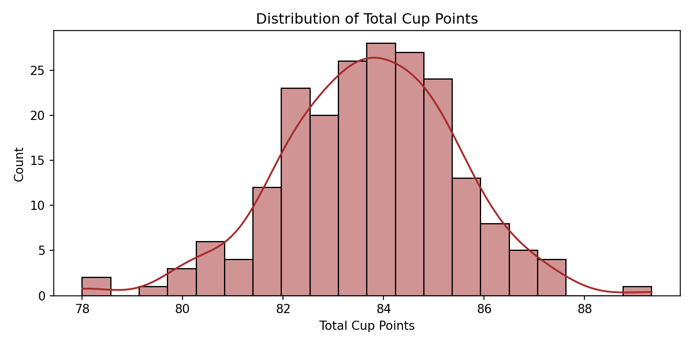
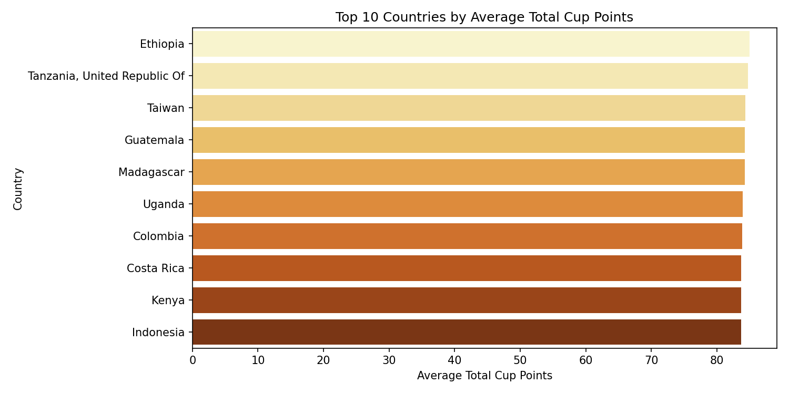
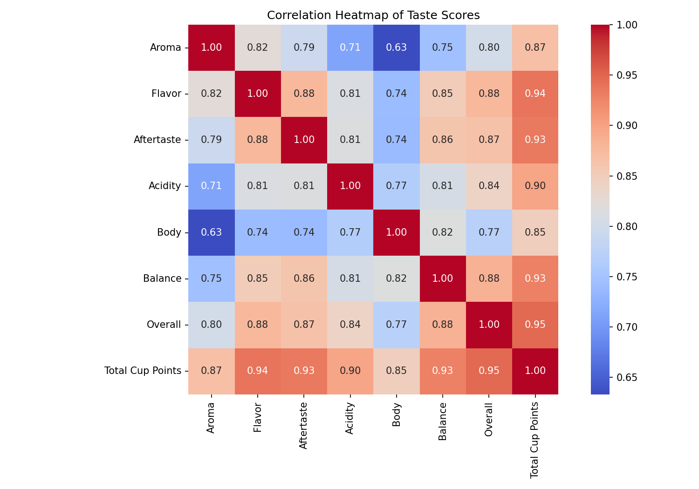
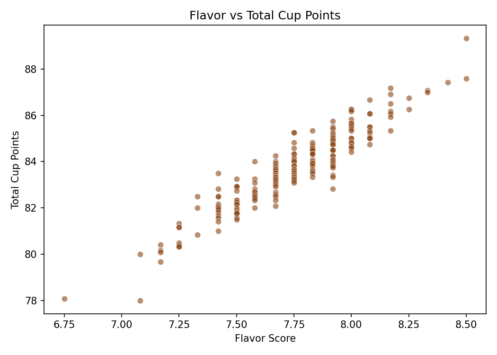
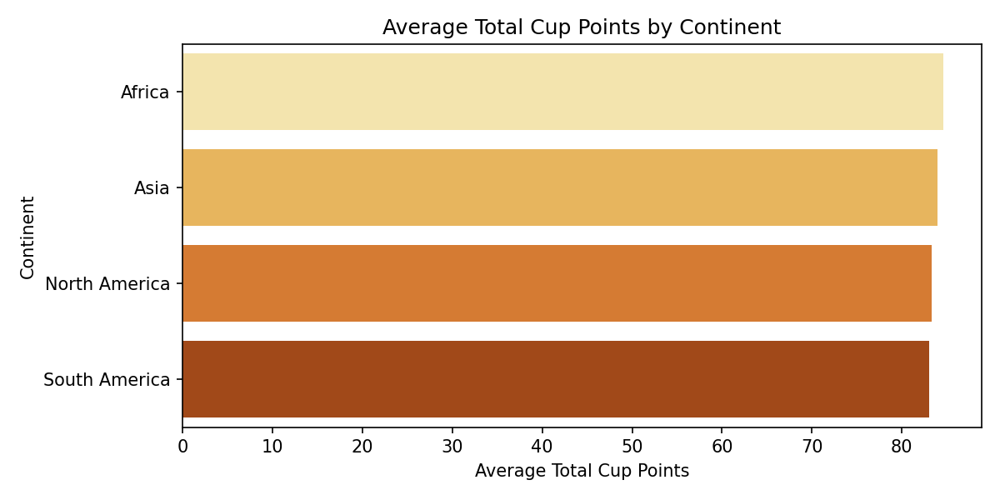
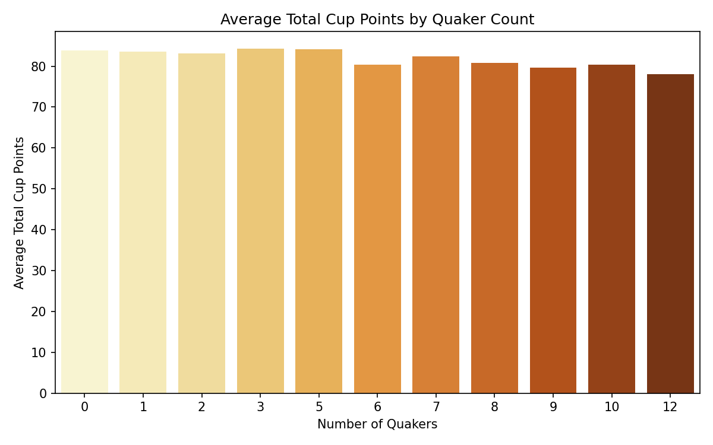

# Coffee Quality Dataset Analysis

An exploratory data analysis of arabica coffee quality scores from around the world, using a public dataset from Kaggle originally collected by the Coffee Quality Institute (CQI).

## Dataset

- **Source:** [Kaggle](https://www.kaggle.com/) — `df_arabica_clean.csv`
- **Size:** 207 rows, 41 columns; each row is a unique coffee sample
- **Main variables:**
  - **Origin & Identity:** Country of Origin, Farm Name, Region, Producer, Variety, Processing Method
  - **Logistics:** Harvest Year, Altitude, Number of Bags, Bag Weight
  - **Taste Scores (scale ~6.5–10):** Aroma, Flavor, Aftertaste, Acidity, Body, Balance, Overall, Total Cup Points
  - **Defects:** Category One Defects, Category Two Defects, Quakers
  - **Certification:** Certification Body, Certification Address, Certification Contact

## Project structure

```
.
├── data/         # Raw dataset (df_arabica_clean.csv)
├── notebooks/    # analysis.ipynb — full EDA workflow
├── visuals/      # Saved chart images
└── report/       # Written summary report
```

## Setup

```bash
pip install -r requirements.txt
jupyter notebook notebooks/analysis.ipynb
```

## Key insights

1. **Overall is the strongest predictor of Total Cup Points.** `Overall` correlates at 0.947 with `Total Cup Points`, followed closely by `Flavor` (0.939) and `Aftertaste` (0.935).
2. **Scores are tightly clustered.** Most samples score between 82 and 86 (mean ≈ 83.7); anything above 87 is a clear outlier representing top-tier specialty coffee.
3. **Missing ICO Numbers suggest a boutique-skewed dataset.** 63.77% of entries lack an ICO tracking number, suggesting many samples entered through competition or boutique channels rather than formal commercial export.
4. **Category One defects are rare; Category Two are not.** 93% of samples have zero Category One defects, but Category Two defects range from 0 to 16 and are a more meaningful quality differentiator within this dataset.
5. **Quakers (underdeveloped beans) negatively affect score.** A weak negative correlation (-0.32) — samples with 0 quakers averaged 83.88 points vs. 78.08 for samples with 12.
6. **A handful of large organizations dominate submissions.** Coffee Quality Union (14 varieties) and Taiwan Coffee Laboratory (12 varieties) submit far more than typical individual producers.
7. **Africa leads by continent.** Africa averages 84.63 points, led by Ethiopia (84.96) and Tanzania (84.74); El Salvador ranks lowest among countries at 81.53. Note that some countries have only one sample, so their averages aren't statistically reliable.

## Visuals

| | |
|---|---|
|  |  |
|  |  |
|  |  |
